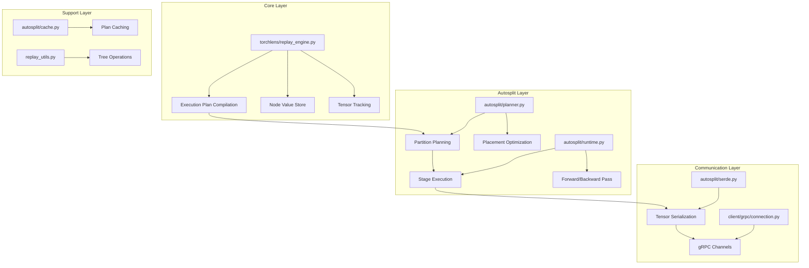
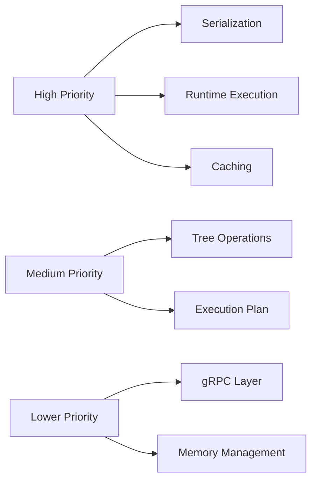

# SplitFleet Code Optimization Plan

## Executive Summary

This document outlines a comprehensive optimization strategy for the SplitFleet codebase, targeting performance improvements across serialization, execution planning, runtime operations, caching, data structures, and network communication.

---

## Architecture Overview



---

## Optimization Areas

### 1. Serialization/Deserialization Performance

**Files Affected:**
- [`splitfleet/autosplit/serde.py`](splitfleet/autosplit/serde.py)
- [`splitfleet/common/serde.py`](splitfleet/common/serde.py)

**Current Issues:**
- Uses `torch.save()`/`torch.load()` with default pickle protocol
- No compression for large tensor payloads
- Repeated serialization of identical model states

**Optimization Strategies:**

| Strategy | Description | Expected Impact |
|----------|-------------|-----------------|
| Use `torch.save(..., _use_new_zipfile_serialization=True)` | Modern zipfile format is faster | 10-20% faster saves |
| Add optional compression | gzip/lz4 for network transfer | 30-50% smaller payloads |
| Implement tensor deduplication | Cache serialized tensors by hash | Reduce redundant serialization |
| Use memory-mapped tensors | For large model states | Lower memory footprint |

**Code Changes:**

```python
# Current implementation in serde.py
def dumps_torch_object(value: Any) -> bytes:
    buffer = io.BytesIO()
    torch.save(value, buffer)
    return buffer.getvalue()

# Optimized implementation
def dumps_torch_object(
    value: Any, 
    *, 
    compress: bool = False,
    compression_level: int = 6
) -> bytes:
    buffer = io.BytesIO()
    torch.save(value, buffer, _use_new_zipfile_serialization=True)
    data = buffer.getvalue()
    if compress:
        import lz4.frame
        return lz4.frame.compress(data, compression_level=compression_level)
    return data
```

---

### 2. Execution Plan Compilation

**Files Affected:**
- [`torchlens/replay_engine.py`](torchlens/replay_engine.py)

**Current Issues:**
- Multiple passes over layer list during compilation
- Redundant parent index lookups
- Inefficient metadata building

**Optimization Strategies:**

| Strategy | Description | Expected Impact |
|----------|-------------|-----------------|
| Single-pass compilation | Combine multiple loops into one | 20-30% faster compilation |
| Pre-compute label-to-index map | Avoid repeated dict lookups | O(1) parent resolution |
| Lazy metadata construction | Build metadata only when needed | Lower memory during tracing |
| Use `__slots__` for ExecNode | Reduce memory per node | 30-40% smaller node objects |

**Code Changes:**

```python
# Optimize _build_node_meta to be lazy
def _build_node_meta(layer, store_minimal_metadata: bool = True) -> Dict[str, Any]:
    if not store_minimal_metadata:
        return {}
    # Only compute essential metadata
    return {
        k: v for k, v in {
            "tensor_shape": tuple(layer.tensor_shape) if layer.tensor_shape else None,
            "tensor_dtype": str(layer.tensor_dtype) if layer.tensor_dtype else None,
        }.items() if v is not None
    }
```

---

### 3. Runtime Execution and Tensor Operations

**Files Affected:**
- [`splitfleet/autosplit/runtime.py`](splitfleet/autosplit/runtime.py)
- [`torchlens/replay_train.py`](torchlens/replay_train.py)

**Current Issues:**
- Repeated device transfers for same tensors
- No tensor pooling for intermediate values
- Inefficient gradient collection

**Optimization Strategies:**

| Strategy | Description | Expected Impact |
|----------|-------------|-----------------|
| Batch device transfers | Move multiple tensors at once | Reduce CUDA synchronization |
| Tensor pooling | Reuse tensor memory across stages | Lower allocation overhead |
| Lazy gradient computation | Only compute needed gradients | Faster backward pass |
| Use `torch.no_grad()` context | Disable grad when not needed | Memory savings |

**Code Changes:**

```python
# Optimize _filter_tensor_grads
def _filter_tensor_grads(values: Dict[int, Any]) -> Dict[int, torch.Tensor]:
    return {
        index: grad.detach().clone()
        for index, value in values.items()
        if isinstance(grad := getattr(value, "grad", None), torch.Tensor)
    }

# Optimize stage execution with tensor pooling
class TensorPool:
    def __init__(self, max_size: int = 100):
        self._pool: Dict[int, torch.Tensor] = {}
        self._max_size = max_size
    
    def get_or_create(self, shape, dtype, device):
        key = (shape, dtype, device)
        if key in self._pool:
            return self._pool.pop(key)
        return torch.empty(shape, dtype=dtype, device=device)
    
    def release(self, tensor: torch.Tensor):
        if len(self._pool) < self._max_size:
            key = (tensor.shape, tensor.dtype, tensor.device)
            self._pool[key] = tensor
```

---

### 4. Caching Mechanisms

**Files Affected:**
- [`splitfleet/autosplit/cache.py`](splitfleet/autosplit/cache.py)

**Current Issues:**
- Synchronous file I/O blocks execution
- No in-memory cache layer
- JSON serialization overhead

**Optimization Strategies:**

| Strategy | Description | Expected Impact |
|----------|-------------|-----------------|
| Add LRU memory cache | Cache frequently accessed plans | Eliminate disk reads |
| Async file operations | Non-blocking cache writes | Smoother execution |
| Binary serialization | Use pickle instead of JSON | Faster serialization |
| Cache invalidation TTL | Auto-expire stale entries | Better memory management |

**Code Changes:**

```python
from functools import lru_cache
from concurrent.futures import ThreadPoolExecutor
import threading

class PlanCacheStore:
    def __init__(self, root_dir: str, max_memory_cache: int = 32) -> None:
        self.root_dir = root_dir
        self._memory_cache: Dict[str, PlanCacheEntry] = {}
        self._cache_lock = threading.Lock()
        self._max_memory_cache = max_memory_cache
        self._executor = ThreadPoolExecutor(max_workers=1)
    
    def load(self, model_name: str) -> Optional[PlanCacheEntry]:
        # Check memory cache first
        with self._cache_lock:
            if model_name in self._memory_cache:
                return self._memory_cache[model_name]
        
        # Fall back to disk
        entry = self._load_from_disk(model_name)
        if entry:
            with self._cache_lock:
                if len(self._memory_cache) >= self._max_memory_cache:
                    self._memory_cache.pop(next(iter(self._memory_cache)))
                self._memory_cache[model_name] = entry
        return entry
    
    def save(self, entry: PlanCacheEntry) -> None:
        with self._cache_lock:
            self._memory_cache[entry.model_name] = entry
        # Async disk write
        self._executor.submit(self._save_to_disk, entry)
```

---

### 5. Tree Operations and Data Structure Handling

**Files Affected:**
- [`torchlens/replay_utils.py`](torchlens/replay_utils.py)

**Current Issues:**
- Recursive tree operations can hit recursion limits
- Multiple tree traversals for same data
- No caching of tree structure

**Optimization Strategies:**

| Strategy | Description | Expected Impact |
|----------|-------------|-----------------|
| Iterative tree flattening | Avoid recursion depth issues | Handle deeper structures |
| Cache TreeSpec | Reuse for identical structures | Faster repeated operations |
| Use `functools.lru_cache` | Cache hash computations | Faster graph signatures |
| Pre-allocate leaf lists | Known size allocations | Fewer memory reallocations |

**Code Changes:**

```python
from functools import lru_cache

@lru_cache(maxsize=1024)
def _hash_tree_spec(spec: TreeSpec) -> int:
    """Cache tree spec hashing for repeated operations."""
    if spec.kind == "leaf":
        return hash("leaf")
    return hash((spec.kind, spec.context, tuple(_hash_tree_spec(c) for c in spec.children)))

def tree_flatten(tree: Any) -> Tuple[List[Any], TreeSpec]:
    """Optimized tree flattening with pre-allocated list."""
    # Estimate leaf count for pre-allocation
    estimated_leaves = _estimate_leaf_count(tree)
    leaves: List[Any] = []
    leaves.reserve(estimated_leaves)  # Pre-allocate if supported
    spec = _tree_flatten_into(tree, leaves)
    return leaves, spec
```

---

### 6. gRPC Communication Layer

**Files Affected:**
- [`splitfleet/client/grpc/connection.py`](splitfleet/client/grpc/connection.py)
- [`splitfleet/server/grpc/servicer.py`](splitfleet/server/grpc/servicer.py)

**Current Issues:**
- No connection pooling
- Default message size limits
- No compression for gRPC messages

**Optimization Strategies:**

| Strategy | Description | Expected Impact |
|----------|-------------|-----------------|
| Enable gRPC compression | Compress messages in transit | 30-50% bandwidth reduction |
| Connection pooling | Reuse gRPC channels | Lower connection overhead |
| Increase message limits | Handle larger batches | Fewer message splits |
| Async gRPC calls | Non-blocking communication | Better throughput |

**Code Changes:**

```python
from grpc import compression

def create_channel(
    server_address: str,
    *,
    insecure: bool = True,
    max_message_length: int = 536_870_912,  # 512MB
    enable_compression: bool = True,
):
    options = [
        ("grpc.max_send_message_length", max_message_length),
        ("grpc.max_receive_message_length", max_message_length),
    ]
    
    if enable_compression:
        options.extend([
            ("grpc.default_compression_algorithm", compression.Gzip),
            ("grpc.default_compression_level", compression.CompressionLevel.medium),
        ])
    
    return grpc.insecure_channel(server_address, options=options)
```

---

### 7. Memory Efficiency Improvements

**Files Affected:**
- Multiple modules across the codebase

**Current Issues:**
- Intermediate tensors retained longer than needed
- No explicit memory cleanup
- Large batch processing can OOM

**Optimization Strategies:**

| Strategy | Description | Expected Impact |
|----------|-------------|-----------------|
| Explicit tensor deletion | `del` after use | Faster GC |
| `torch.cuda.empty_cache()` | Periodic cache clearing | Lower GPU memory |
| Gradient checkpointing | Trade compute for memory | Handle larger models |
| Streaming batch processing | Process in chunks | Lower peak memory |

**Code Changes:**

```python
import gc
import torch

class MemoryManagedExecution:
    def __init__(self, clear_interval: int = 10):
        self._clear_interval = clear_interval
        self._execution_count = 0
    
    def after_execution(self):
        self._execution_count += 1
        if self._execution_count % self._clear_interval == 0:
            gc.collect()
            if torch.cuda.is_available():
                torch.cuda.empty_cache()
```

---

## Implementation Priority



### Phase 1: High Impact, Low Risk
1. Serialization optimization with compression
2. In-memory caching layer
3. Gradient collection optimization

### Phase 2: Medium Impact, Moderate Risk
1. Tree operation caching
2. Single-pass compilation
3. Tensor pooling

### Phase 3: Lower Impact, Higher Risk
1. gRPC compression and pooling
2. Memory management improvements
3. Async operations

---

## Testing Strategy

Each optimization should be validated with:

1. **Unit Tests**: Verify correctness of optimized functions
2. **Benchmarks**: Compare before/after performance
3. **Memory Profiling**: Ensure no memory regressions
4. **Integration Tests**: Full pipeline validation

### Benchmark Metrics

| Metric | Current Baseline | Target |
|--------|------------------|--------|
| Plan compilation time | TBD | -20% |
| Serialization time | TBD | -30% |
| Memory per stage | TBD | -25% |
| gRPC throughput | TBD | +40% |
| Cache hit latency | TBD | -90% |

---

## Risk Assessment

| Risk | Mitigation |
|------|------------|
| Breaking changes to serialization | Version compatibility checks |
| Memory leaks from tensor pooling | Pool size limits and cleanup |
| gRPC compression overhead | Configurable compression levels |
| Cache invalidation issues | TTL and explicit invalidation API |

---

## Next Steps

1. Review this plan with stakeholders
2. Set up benchmarking infrastructure
3. Implement Phase 1 optimizations
4. Validate with existing test suite
5. Measure and document improvements
